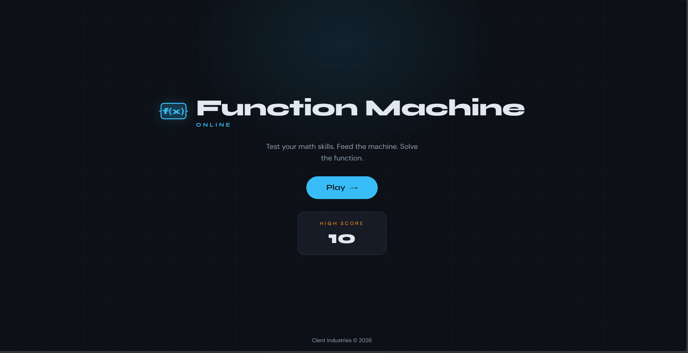
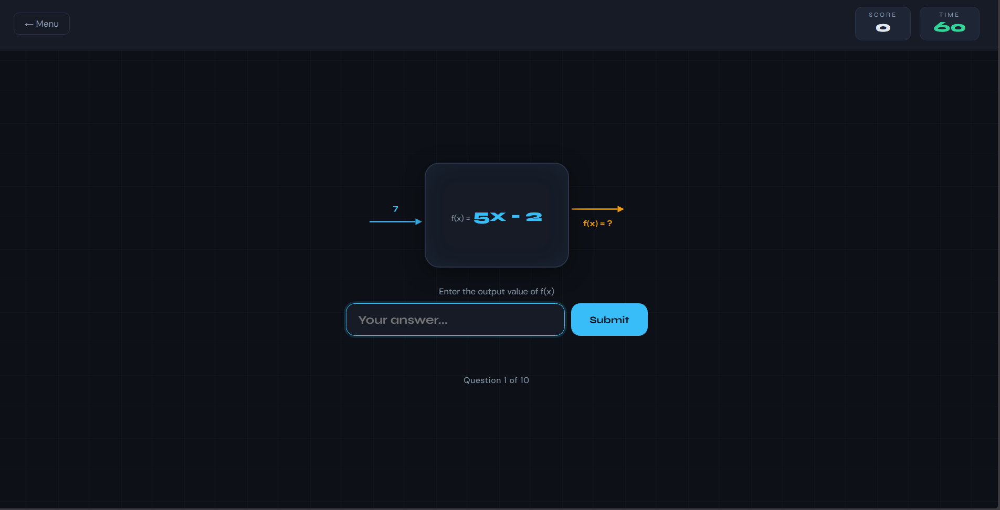

# Function Machine Online

> A timed browser-based math game where players solve function outputs against the clock.

---

## 📸 Preview

<!-- Replace the lines below with your own screenshots -->

| Main Menu | Game Screen |
|:---------:|:-----------:|
|  |  |

> **Tip:** Create a `screenshots/` folder in the project root and drop your images in. Update the filenames above to match.

---


## 🎮 How It Works

1. Player lands on **index.html** (main menu) and sees their saved high score.
2. Pressing **Play** fades into **game.html**.
3. Each round presents **10 questions**, each showing a function rule (e.g. `2x + 3`) and an input value. The player types the output.
4. A **60-second countdown** runs throughout. The game ends when time runs out or all questions are answered.
5. Correct answers award **+10 points**. Wrong answers skip to the next question with no score penalty.
6. The final score is compared to the saved high score in **`localStorage`**. If it's a new record, it's saved automatically.
7. From the Game Over overlay, the player can **Play Again** or return to the **Main Menu**, which now reflects the updated high score.


---

## ➕ Adding Your Own Function Machine Image

The game supports a custom machine image. Place your image in the project folder, then in `game.html` find the `#machineBody` element and swap the placeholder:

```html
<!-- Remove the placeholder div and enable the img tag -->

```

Or handle it dynamically in `game.js`:

```js
document.getElementById('machineImg').src = 'your-image.png';
document.getElementById('machineImg').style.display = 'block';
document.getElementById('machinePlaceholder').style.display = 'none';
```

---

## 📐 Responsive Breakpoints (`style.css`)

| Breakpoint | Target |
|---|---|
| `≤ 768px` | Tablets — stacked logo, smaller machine |
| `≤ 480px` | Phones — vertical input layout, full-width buttons |
| `≤ 360px` | Small phones (e.g. iPhone SE) — further compression |
| `hover: none` | Touch devices — tap feedback replaces hover effects |

---

## 🧠 Function Pool

The game randomly selects from 12 built-in math functions. To add or remove functions, edit the `FUNCTIONS` array in `game.js`:

```js
const FUNCTIONS = [
  { label: '2x + 3',   fn: x => 2 * x + 3 },
  { label: 'x² - 1',  fn: x => x * x - 1 },
  // Add your own here...
];
```

Each entry requires a `label` (displayed in the machine) and `fn` (the actual calculation).

---

## 🛠️ Tech Stack

- **Vanilla HTML / CSS / JavaScript** — no frameworks, no dependencies
- **localStorage** — persists high score across sessions
- **Google Fonts** — Syne (display) + DM Sans (body)

---

## 🚀 Running Locally

No build step required. Just open `index.html` in any modern browser, or serve with any static file server:

```bash
# Using VS Code Live Server, or:
npx serve .
```

---

## 📄 License

MIT — free to use and modify.
